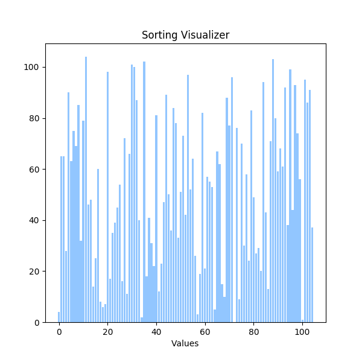

# Algo Visualizer

This is a simple python script that generates visualizations for sorting algorithms and stores the result in a gif.

Here are the results of the few algorithms I visualized.

### Merge sort

### Bubble sort

### Selection sort

### Insertion sort

## Running the program
> Make sure to have matplotlib and numpy installed
> python visualizer.py