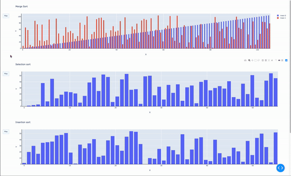

# Algo Visualizer

## Introduction
This repository contains a dash app that uses plotly to visualize a few common sorting algorithms. You can also see how they fare in Time Complexity when sorting low (n) arrays.

| Sorting Algorithm | Average Case           | Worst Case          |
| ----------------- | ---------------------- | ------------------- |
| Bubble Sort       | O(N^2)                 | O(N^2)              |
| Insertion Sort    | O(N^2)                 | O(N^2)              |
| Selection Sort    | O(N^2)                 | O(n^2)              |
| Merge Sort        | O(NlogN)               | O(NlogN)            |

## Demo of the Dash App

## Dependencies
- python3.x
- dash==1.2.0
- dash-core-components==1.1.2
- dash-daq==0.1.7
- dash-html-components==1.0.1
- dash-renderer==1.0.1
- dash-table==4.2.0
- numpy==1.16.4
- matplotlib==3.1.0

## Quick Start Guide
1. Installing dependencies
   - `pip3 install -r requirements.txt`
2. Run the python app
   -  `python3 app.py`
3. Voilà!